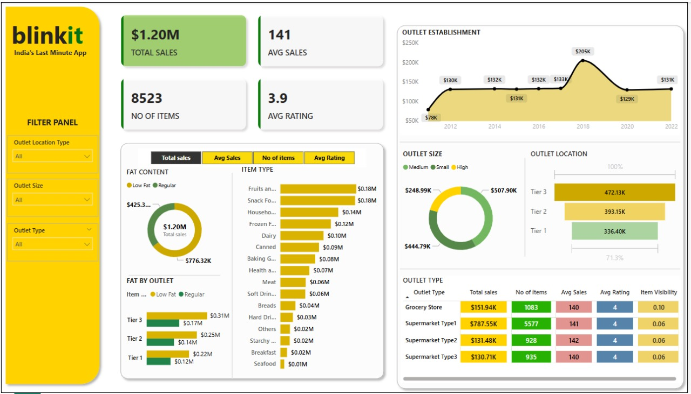

# Blinkit_Grocery_PowerBi
 "Power BI project analyzing Blinkit grocery dataset"
 # 📊 Blinkit Grocery Power BI Dashboard

)

## 🔍 Project Overview

This Power BI project analyzes the **Blinkit Grocery dataset** to uncover insights related to sales, item types, outlet types, and customer preferences. It uses interactive filters and data visuals to highlight key business metrics and trends across various categories.

---

## 📁 Project Files

- `BlinkitGrocery.pbix` – The Power BI report file with complete dashboard and data model.
- `images/dashboard_screenshot.jpg` – A screenshot preview of the dashboard.
- `README.md` – Documentation of the project.

---

## 📌 Key Dashboard Features

### 🧮 KPIs
- 💰 **Total Sales**: $1.20M  
- 📦 **Number of Items**: 8523  
- 📈 **Average Sales per Item**: 141  
- ⭐ **Average Rating**: 3.9  

### 🗂️ Outlet & Product Analysis
- Outlet establishment trends (2010 to 2022)
- Outlet size breakdown: Small, Medium, High
- Outlet location tiers: Tier 1, Tier 2, Tier 3
- Product performance by item type and fat content (Low Fat vs Regular)
- Sales comparison across outlet types and item visibility

---

## 🧠 Insights

- **Supermarket Type1** leads with the highest sales and item count.
- **Tier 3 cities** contribute the most to total sales.
- **Snack Foods** and **Fruits & Vegetables** are the top-selling categories.
- **Regular fat** products are more popular than low-fat across all tiers.

---

## 🎯 Filters Available

- Outlet Location Type  
- Outlet Size  
- Outlet Type  

These filters make it easy to explore and drill down into specific segments.

---

## 🛠️ Tools Used

- **Microsoft Power BI Desktop**
- **Power Query** for data transformation
- **DAX (Data Analysis Expressions)** for measures and KPIs

---

## 🚀 How to View This Project

1. Download the `.pbix` file.
2. Open it in [Power BI Desktop](https://powerbi.microsoft.com/desktop/).
3. Use the filters to interact with the dashboard and explore the insights.

---

## 📬 Feedback

Have suggestions or improvements? Feel free to open an issue or fork the repo and contribute.

If you liked this project, **give it a ⭐ star**!

---

